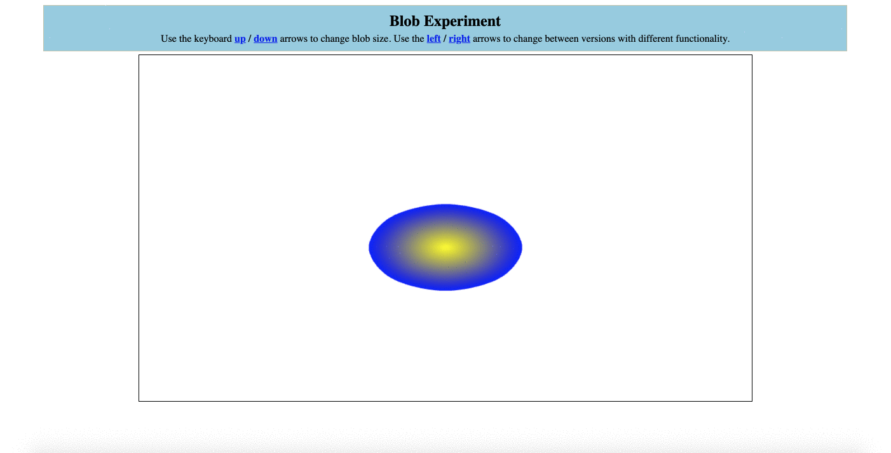

# Bouncing_2D_Mesh (Group Project)

While attempting to render a Mesh that models blob like physics, we created the following demo. Manipulate the Mesh's size by pressing the "up" or "down" arrows on your key board. Click, drag, and drop the Mesh from anywhere on the page and watch as gravity, velocity, and its mass causes it to change shape. Use your "left" and "right" arrow keys to toggle between modes -- Blob Mode or Ball Mode.

## Table of Contents  
[Getting Started](#getting-started)

[Project Description](#project-description)

## Getting Started

1.  Clone the repo:

        git clone https://github.com/shinellm/CSC385_Bouncing_2D_Mesh.git

2.  Use the WebStorm editor to open our project. WebStorm can be downloaded from this link: https://www.jetbrains.com/webstorm/. NOTE: You can also use your prefered Javascript editor, but the project was originally built and ran in WebStorm.

3.  Navigate to the 'index.js' file and open the URL of the local file in the chrome browser (if you hover in the file, you will see 4 browser icons in the top right corner).

## Project Description:

The CSC385---Bouncing_2D_Mesh folder contains our current rendering of a Mesh modeling blob like physics. We decided to keep separate implementations of the blob. The initial version upon load implements a blob with spring forces acting upon it. The second version implements a rigid body simulation of a blob responding to collision with the border of the canvas. You can switch between versions by pressing the left or right key on your keyboard. 
	
	Our main files are:
	CSC385---Bouncing_2D_Mesh/
        		index.html (Created our own html code)
        		js/	
        			blob_main.js (Mouse/Canvas Listeners, init(), render(), etc)
        			blob_mesh.js (Constructs a Blob function for our Blob World function)
        			helpers.js (Simple helper functions from project 3)
        			initShaders.js (Initialize the shader)
        			MV.js (Matrix and vector functions)
        			webgl_utils.js 
	
	*After switching from version 1 into version 2 and then back, dragging the blob causes it to become extremely elongated in the 
	-y direction. In addition, if you size down the blob and then change to version 2, it causes the blob velocities to increase.
	Sizing up the ball and clicking should resolve this.
	

NOTE: The BlobExample folder holds a copy of Hakim El Hattab's blob implementation that we hoped to build upon (https://lab.hakim.se/blob/03/). The SimpleBouncingBall and SpringTest are testing environments we wrote, which were later used in the creation of our blob implementation.

